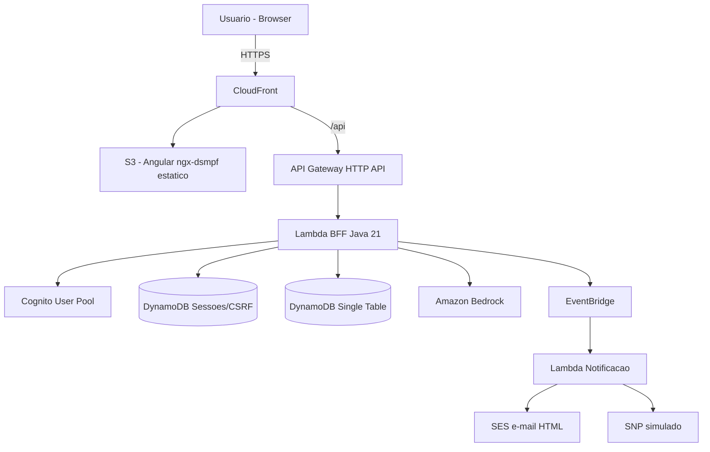
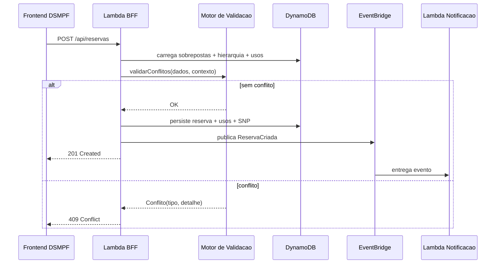
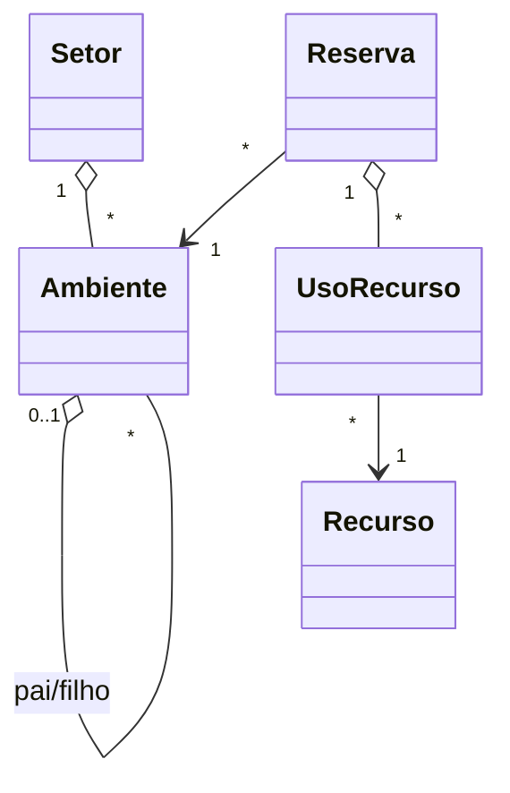

# Design Document

**Solare — MVP Hackathon AWS × MPF**

## Overview

O Solare é um sistema serverless e orientado a eventos para solicitação e acompanhamento de reservas de ambientes (com hierarquia pai/filho) e recursos (limitados e ilimitados), atendendo os perfis Solicitante, Administrador e Setor Atendente. O design concilia o padrão fullstack do DSMPF (frontend Angular + backend Java com segurança baseada em sessão/CSRF, conforme o projeto demo `C:\Users\usuario\dsmpf-demo-full-spring`) com uma arquitetura AWS serverless (Lambda, API Gateway, DynamoDB, EventBridge, SES, Bedrock, Cognito) na região `us-east-1` com o profile `hackaton`, maximizando os seis critérios do hackathon.

Princípios de design:

- Núcleo de regras de negócio puro e isolado de infraestrutura, para testabilidade máxima das regras RN1–RN13.
- Identidade acessada por meio de uma abstração (`IdentidadeProvider`), com implementação stub durante o desenvolvimento e substituição pela autenticação real (Cognito) perto do fim, sem impacto nos consumidores.
- Compatibilidade com os contratos de segurança do DSMPF (`/api/__seguranca/*`, CSRF, papéis/atuações).
- Desacoplamento das notificações via eventos de domínio.
- Infraestrutura como código, reproduzível.

### Mapeamento com os requisitos

| Requisito | Onde é atendido no design |
|---|---|
| F1–F3 (cadastros) | Componentes de domínio Setor/Ambiente/Recurso + controllers REST + telas DSMPF |
| F4, F7 (reservas e edição) | Serviço de Reserva + Motor de Validação de Conflitos |
| F5 (grade 30 min) | Serviço de Disponibilidade + componente de grade acessível |
| F6 (cards do atendente) | Consulta por data (GSI) + componente de cards |
| F8 (notificações) | Eventos de domínio + EventBridge + Lambda de notificação + SES |
| RN1–RN13 | Motor de Validação de Conflitos (módulo puro) |
| INOV1 (Bedrock) | Serviço do Assistente de Reserva (NL para intenção para disponibilidade) |
| NF1 (serverless/eventos) | Lambda, API Gateway, DynamoDB, EventBridge; IaC SAM |
| NF2 (acessibilidade) | Componentes DSMPF, ARIA, navegação por teclado, responsividade |
| NF3 (segurança/LGPD) | Cognito, IAM mínimo, sanitização, criptografia, dados fictícios |
| NF4 (qualidade) | Testes do núcleo RN1–RN13, modularidade, build/test verdes |
| NF5 (compatibilidade DSMPF) | BFF expõe `/api/__seguranca/*`, `provideConfiguracaoBasica`, guardas `DsAppSeguranca` |

## Architecture

### Visão de componentes AWS

### Reconciliação BFF-DSMPF e serverless

O projeto demo é um monólito stateful (Spring Boot + `access-manager-seguranca`, sessão + CSRF). Para preservar fidelidade ao DSMPF sem abrir mão do serverless, o Solare adota um BFF em Lambda (Java 21) que:

- Expõe os mesmos contratos de segurança que o frontend DSMPF espera: `/api/__seguranca/usuario`, `/atuacoes-json`, `/papeis`, `/atuacoes/atual`, `/atuacoes`, `logout` e CSRF em `/api/__seguranca/csrf`.
- Externaliza a sessão e o token CSRF em uma tabela DynamoDB com TTL (em vez de sessão em memória), tornando o BFF efêmero e horizontalmente escalável.
- Autentica contra o Cognito User Pool e mapeia grupos (`SOLICITANTE`, `ADMIN`, `ATENDENTE`) para papéis/atuações do DSMPF.
- Mantém a sessão em cookie HttpOnly/Secure e valida o header CSRF nas requisições mutantes, espelhando a proteção do demo.

Alternativa considerada e descartada para o MVP: BFF em container (Fargate/App Runner) com sessão em memória — mais fiel ao demo, porém com custo base contínuo e menor pontuação em serverless puro (Critério 2).

### Fluxo de criação de reserva (F4 + RN1–RN13 + F8)

## Components and Interfaces

### Camadas do backend (BFF Java 21)

A organização segue a inspiração do projeto demo (controllers por domínio, base com paginação), com o núcleo de regras isolado:

- **Camada de API (controllers)**: `SetorController`, `AmbienteController`, `RecursoController`, `ReservaController`, `AssistenteController`, `SegurancaController`. Herdam utilidades de uma base equivalente a `RecursoRestBaseController` (paginação `page`/`size`/`sort`). Responsáveis por desserialização, validação de forma e sanitização.
- **Camada de aplicação (serviços)**: `SetorService`, `AmbienteService`, `RecursoService`, `ReservaService`, `DisponibilidadeService`, `AssistenteReservaService`. Orquestram casos de uso e transações lógicas.
- **Núcleo de domínio (puro)**: `MotorValidacaoConflitos` e tipos de valor (`Periodo`, `Reserva`, `Ambiente`, `Recurso`, `UsoRecurso`, resultados de conflito). Sem dependência de AWS/Spring — 100% testável por unidade.
- **Camada de infraestrutura**: `DynamoReservaRepository`, `DynamoAmbienteRepository`, `DynamoRecursoRepository`, `DynamoSetorRepository`, `DynamoSessaoRepository`, `EventPublisher` (EventBridge), `BedrockClient`, `IdentidadeProvider`.

### Interface do Motor de Validação de Conflitos (núcleo)

- `ResultadoValidacao validar(SolicitacaoReserva solicitacao, ContextoDisponibilidade contexto)`
  - `SolicitacaoReserva`: ambienteId, período (início/fim), lista de (recursoId, quantidade), e opcionalmente o id da própria reserva em edição.
  - `ContextoDisponibilidade`: reservas existentes do ambiente e de seus ancestrais/descendentes no período; definição dos recursos (tipo e quantidade total); usos de recurso sobrepostos.
  - `ResultadoValidacao`: `semConflito` OU lista de conflitos tipados: `CONFLITO_HORARIO`, `CONFLITO_MARGEM`, `CONFLITO_HIERARQUIA`, `ESTOURO_RECURSO`, cada um com detalhe legível.

Funções puras auxiliares:

- `boolean haInterseccaoComMargem(Periodo a, Periodo b, Duration margem)` — trata sobreposição total, parcial (início/fim) e contenção, aplicando a margem de 30 minutos (RN1–RN3, RN11, RN13).
- `boolean conflitaHierarquia(ambienteAlvo, reservasPorAmbiente, arvore)` — expande ancestrais e descendentes (RN4–RN6).
- `boolean estouraRecurso(usosSobrepostos, quantidadeSolicitada, quantidadeTotal)` — soma usos sobrepostos e compara (RN7–RN9); recursos ilimitados retornam sempre falso (RN10).
- Na edição, a própria reserva (versão anterior) é excluída do contexto (RN12).

### IdentidadeProvider (abstração de identidade)

- `Identidade identidadeAtual(Requisicao req)` → `{ usuarioId, nome, papeis[], atuacaoAtual }`.
- Implementações:
  - `StubIdentidadeProvider` (desenvolvimento): resolve a partir de headers `X-Dev-User` / `X-Dev-Role`. Habilitado apenas fora de produção.
  - `CognitoIdentidadeProvider` (produção): resolve a partir da sessão (cookie) validada contra o Cognito, mapeando grupos para papéis.
- Todos os serviços e a autorização consomem essa interface, de modo que a troca stub para Cognito é localizada.

### Endpoints de segurança compatíveis com DSMPF

| Endpoint | Método | Descrição |
|---|---|---|
| `/api/__seguranca/usuario` | GET | Usuário autenticado atual (ou anônimo) |
| `/api/__seguranca/papeis` | GET | Papéis do usuário |
| `/api/__seguranca/atuacoes-json` | GET | Atuações disponíveis |
| `/api/__seguranca/atuacoes/atual` | GET | Atuação corrente |
| `/api/__seguranca/atuacoes` | POST | Troca de atuação |
| `/api/__seguranca/csrf` | GET | Token CSRF |
| `logout` | POST | Encerra a sessão |

### Endpoints de negócio (resumo)

| Endpoint | Método | Perfil | Requisito |
|---|---|---|---|
| `/api/manutencao/setores` | GET/POST/PUT/DELETE | ADMIN | F1 |
| `/api/manutencao/ambientes` | GET/POST/PUT/DELETE | ADMIN | F2 |
| `/api/manutencao/recursos` | GET/POST/PUT/DELETE | ADMIN | F3 |
| `/api/reservas` | POST/PUT | SOLICITANTE | F4, F7 |
| `/api/reservas/disponibilidade` | GET | SOLICITANTE | F5 |
| `/api/reservas/atendente` | GET | ATENDENTE | F6 |
| `/api/assistente/sugestoes` | POST | SOLICITANTE | INOV1 |

Os caminhos sob `/api/manutencao/**` seguem o padrão do demo (restrito a perfil de gestão).

### Frontend (Angular + ngx-dsmpf)

- Inicialização via `provideConfiguracaoBasica` com `parametrosAplicacao` (nome "Solare", sigla, logo, `api.raiz = /api`) e `parametrosSeguranca` (endpoints `/api/__seguranca/*`).
- Rotas protegidas com guardas `DsAppSeguranca` (`isUsuarioAutenticadoAssincrono`, `isUsuarioAutorizadoAssincrono(papel)`), espelhando `app.routes.ts` do demo.
- Componentes-chave:
  - `GradeDisponibilidadeComponent` (F5): grade data por slots de 30 min, acessível (roles/ARIA, navegação por teclado, foco visível), responsiva.
  - `CardsAtendenteComponent` (F6): cards agrupados por data com solicitante, finalidade e SNP.
  - `FormularioReservaComponent` (F4/F7): criação/edição com destaque de alterações.
  - `AssistenteReservaComponent` (INOV1): entrada em linguagem natural e exibição de sugestões.

## Data Models

### Estratégia DynamoDB (single-table)

Tabela única `solare` com chave de partição `PK` e chave de ordenação `SK`, e três índices secundários globais (GSI1, GSI2, GSI3). O design privilegia as consultas quentes: conflito por ambiente, filhos por pai, usos de recurso por janela, reservas por solicitante e reservas por data.

| Entidade | PK | SK | Atributos principais | Índice |
|---|---|---|---|---|
| Setor | `SETOR#{id}` | `META` | nome, sigla, emailNotificacao | — |
| Ambiente | `AMB#{id}` | `META` | nome, setorId, ambientePaiId, capacidade | GSI1PK=`PAI#{ambientePaiId}`, GSI1SK=`AMB#{id}` |
| Recurso | `REC#{id}` | `META` | nome, tipo (LIMITADO/ILIMITADO), quantidadeTotal | — |
| Reserva | `AMB#{ambienteId}` | `RES#{inicioISO}#{reservaId}` | solicitanteId, solicitanteNome, finalidade, inicio, fim, status, snp, recursos[] | GSI2PK=`SOLIC#{solicitanteId}`; GSI3PK=`DATA#{yyyy-mm-dd}` |
| UsoRecurso | `REC#{recursoId}` | `USO#{inicioISO}#{reservaId}` | quantidade, inicio, fim, ambienteId | — |
| Sessão | `SESS#{sessionId}` | `META` | usuarioId, papeis, atuacaoAtual, csrfToken, expiraEm (TTL) | TTL em `expiraEm` |

### Padrões de acesso

- **Conflito por ambiente (RN1–RN3)**: `Query PK = AMB#{ambienteId}` com `SK begins_with RES#` filtrando por janela [início − 30min, fim + 30min].
- **Hierarquia (RN4–RN6)**: resolve ancestrais subindo por `ambientePaiId` e descendentes via `Query GSI1 PK = PAI#{id}`; para cada ambiente relacionado, repete a consulta de conflito.
- **Recursos limitados (RN7–RN9)**: `Query PK = REC#{recursoId}` com `SK begins_with USO#` na janela sobreposta; soma `quantidade`.
- **Reservas do solicitante**: `Query GSI2 PK = SOLIC#{usuarioId}`.
- **Cards do atendente por data (F6)**: `Query GSI3 PK = DATA#{dia}`.
- **Sessão/CSRF**: GET/PUT em `SESS#{sessionId}`; expiração automática por TTL.

### Integridade e concorrência

- A gravação da reserva usa escrita condicional (e, quando múltiplos itens, `TransactWriteItems`) para persistir Reserva + itens `UsoRecurso` de forma atômica, reduzindo a janela de corrida entre validação e gravação.
- O `status` da reserva permite cancelamento lógico sem apagar histórico.

### Modelo de domínio (conceitual)

## Correctness Properties

Propriedades invariantes que os testes do núcleo devem sustentar (base para testes orientados a propriedades sobre as RN):

### Property 1: Simetria de conflito
Se a reserva A conflita com B, então B conflita com A (mesma relação de interseção com margem).

**Validates: Requirements 1.1, 1.11**

### Property 2: Monotonicidade da margem
Aumentar a margem nunca remove um conflito previamente detectado.

**Validates: Requirements 1.2, 1.13**

### Property 3: Hierarquia transitiva
Um conflito entre um ambiente e qualquer ancestral/descendente implica indisponibilidade mútua no período.

**Validates: Requirements 1.4, 1.5, 1.6**

### Property 4: Conservação de recurso limitado
Em nenhum instante a soma das quantidades confirmadas de um recurso limitado excede sua quantidade total.

**Validates: Requirements 1.7, 1.8, 1.9**

### Property 5: Neutralidade do ilimitado
Recursos ilimitados nunca alteram o resultado de conflito por quantidade.

**Validates: Requirements 1.10**

### Property 6: Idempotência na edição
Revalidar uma reserva inalterada contra ela mesma (excluindo sua versão anterior) não gera conflito.

**Validates: Requirements 1.12**

## Error Handling

- **Validação de forma (400)**: campos ausentes/inválidos retornam erro por campo; sanitização de strings contra injeção.
- **Autorização (401/403)**: acessos não autenticados ou cross-perfil são negados pela checagem de papel via `IdentidadeProvider`.
- **Conflito de reserva (409)**: o motor retorna o tipo de conflito (`CONFLITO_HORARIO`, `CONFLITO_MARGEM`, `CONFLITO_HIERARQUIA`, `ESTOURO_RECURSO`) com mensagem legível; o controller mapeia para 409.
- **Assistente/Bedrock**: saída malformada ou baixa confiança resulta em fallback orientando preenchimento manual, sem quebrar o fluxo.
- **Falhas de notificação**: desacopladas via EventBridge; reprocessamento por retry/DLQ sem afetar a resposta ao usuário.
- **Erros inesperados (500)**: tratados por um handler global (equivalente ao `GlobalExceptionController` do demo), sem vazar stack trace nem PII.

## Security and Privacy

- **Autenticação**: Cognito User Pool; grupos `SOLICITANTE`, `ADMIN`, `ATENDENTE` mapeados para papéis/atuações DSMPF. Sessão em cookie HttpOnly/Secure com CSRF, estado em DynamoDB (TTL).
- **Autorização (menor privilégio na aplicação)**: cada endpoint sensível verifica o papel via `IdentidadeProvider`; `/api/manutencao/**` restrito a ADMIN; painel do atendente restrito a ATENDENTE; reservas vinculadas ao solicitante.
- **IAM (menor privilégio na nuvem)**: cada Lambda recebe uma role dedicada com permissões mínimas (ex.: a Lambda de notificação só acessa SES e lê o evento; o BFF só acessa a tabela e publica no EventBridge; apenas o serviço do assistente invoca o Bedrock).
- **Validação/sanitização**: validação de forma e sanitização de strings em todos os endpoints de entrada, protegendo contra injeção.
- **Criptografia**: HTTPS fim a fim (CloudFront/API Gateway); criptografia em repouso no DynamoDB (SSE/KMS).
- **Host Header / firewall**: espelhar a proteção do demo (lista de hosts permitidos) na borda.
- **LGPD**: apenas dados fictícios no MVP; sem PII sensível em logs ou respostas; dados pessoais restritos a quem precisa pelo controle de perfil.
- **Stub de identidade**: o `StubIdentidadeProvider` e os headers `X-Dev-*` são desabilitados/ignorados em produção (verificado por teste).

## Testing Strategy

- **Núcleo de conflitos (prioridade máxima — NF4, Critérios 1 e 6)**: testes unitários do `MotorValidacaoConflitos` cobrindo cada regra RN1–RN13: bordas exatas de 30 minutos (RN2/RN3), sobreposição total/parcial/contenção (RN11), pai→filho e filho→pai em múltiplos níveis (RN4–RN6), estouro e não-estouro de recurso limitado (RN8/RN9), recurso ilimitado (RN10), exclusão da própria reserva na edição (RN12), consistência da margem (RN13). Por serem funções puras, rodam sem AWS.
- **Serviços e repositórios**: testes de integração com DynamoDB local/emulado para padrões de acesso e gravação transacional.
- **Autorização**: testes garantindo negação cross-perfil em todos os endpoints sensíveis, com stub e, depois, com Cognito.
- **Frontend**: testes unitários de componentes (geração de slots da grade, agrupamento de cards, diff de edição) e verificações de acessibilidade (rótulos/roles, foco por teclado).
- **Assistente (INOV1)**: testes do parser de saída do Bedrock (JSON para intenção) com respostas mockadas, incluindo o caminho de fallback.
- **Smoke E2E**: fluxo F1–F8 ponta a ponta (local e/ou pós-deploy), incluindo um caso de conflito, um de hierarquia e um de estouro de recurso para a demo.

## Deployment and Infrastructure

- **IaC**: AWS SAM como padrão (simplicidade com Lambda Java). Define tabela DynamoDB (PK/SK + GSI1/2/3 + TTL), funções Lambda (BFF e Notificação) com roles mínimas, API Gateway HTTP API, EventBridge bus/regras, Cognito User Pool + grupos, SES (sandbox para a demo) e distribuição S3 + CloudFront.
- **Profile e região AWS**: todos os comandos AWS CLI e de deploy usam `--profile hackaton` e região `us-east-1` (ex.: `sam deploy --profile hackaton --region us-east-1`); o SDK no backend é configurado para o profile `hackaton`; `AWS_PROFILE=hackaton` nas variáveis de ambiente sugeridas.
- **Desenvolvimento híbrido**: executar localmente com DynamoDB local/`sam local` e identidade stub; o mesmo template provisiona o ambiente real quando desejado.
- **Build**: backend Java 21 (Maven); frontend Angular empacotado e publicado no S3. Um comando de deploy.
- **Seed de demonstração**: script popula dados fictícios coerentes (setores, hierarquia de ambientes, recursos limitados/ilimitados e reservas que exercitam conflito/hierarquia/estouro) para o pitch de 5 minutos.
- **Observabilidade**: logs estruturados sem PII; métricas básicas por função.

## Design Decisions and Rationale

- **Single-table DynamoDB**: alinha-se ao serverless e à escala sem re-arquitetura (Critério 6); as chaves foram desenhadas a partir dos padrões de acesso quentes.
- **BFF Lambda com sessão externalizada**: preserva a compatibilidade DSMPF (sessão + CSRF, `/api/__seguranca/*`) sem custo base de container, mantendo serverless puro (Critério 2).
- **Núcleo de regras puro**: maximiza a cobertura de testes das RN1–RN13 e a manutenibilidade (Critérios 1 e 6), isolando a lógica crítica da infraestrutura.
- **IdentidadeProvider com stub**: permite construir e testar autorização desde cedo e adiar o acoplamento ao Cognito, reduzindo risco de cronograma.
- **Eventos para notificação**: desacopla o caminho crítico da reserva do envio de e-mail (Critério 2) e permite evoluir para o SNP real via MCP (stretch) sem reescrita.
- **Bedrock para o assistente**: diferencia a solução (Critério 3) reutilizando o motor de disponibilidade já testado, com validação estrita da saída do modelo.

