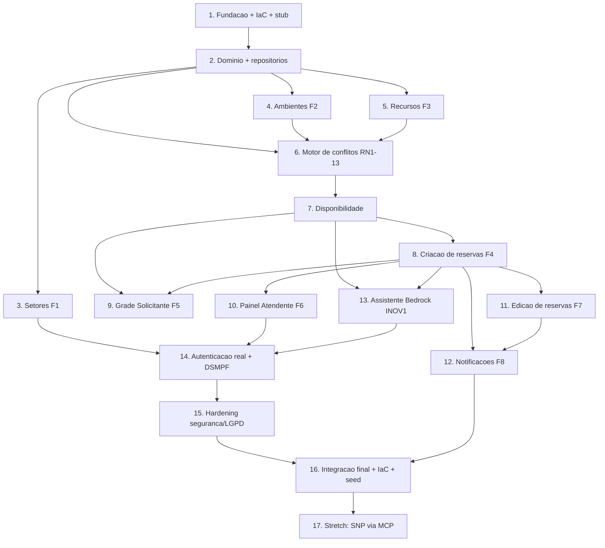

# Implementation Plan

**Solare — MVP Hackathon AWS × MPF**

## Overview

Convenções: toda operação AWS (CLI, SAM, SDK) usa `--profile hackaton` e região `us-east-1`. Cada tarefa entrega um incremento testável e constrói sobre a anterior. A autenticação real foi posicionada perto do fim; até lá, a identidade vem de um stub.

## Task Dependency Graph




```json
{
  "waves": [
    { "wave": 1, "tasks": ["1"] },
    { "wave": 2, "tasks": ["2"] },
    { "wave": 3, "tasks": ["3", "4", "5"] },
    { "wave": 4, "tasks": ["6"] },
    { "wave": 5, "tasks": ["7"] },
    { "wave": 6, "tasks": ["8"] },
    { "wave": 7, "tasks": ["9", "10", "11", "13"] },
    { "wave": 8, "tasks": ["12"] },
    { "wave": 9, "tasks": ["14"] },
    { "wave": 10, "tasks": ["15"] },
    { "wave": 11, "tasks": ["16"] },
    { "wave": 12, "tasks": ["17"] }
  ],
  "dependencies": {
    "2": ["1"],
    "3": ["2"], "4": ["2"], "5": ["2"],
    "6": ["2", "4", "5"],
    "7": ["6"],
    "8": ["7"],
    "9": ["7", "8"], "10": ["8"], "11": ["8"], "13": ["7", "8"],
    "12": ["8", "11"],
    "14": ["3", "10", "13"],
    "15": ["14"],
    "16": ["15", "12"],
    "17": ["16"]
  }
}
```

## Tasks
- [x] 1. Fundação do projeto, IaC base e stub de identidade
  - Criar monorepo: `frontend` (Angular + ngx-dsmpf), `backend` (Java 21 Maven) e `infra` (AWS SAM).
  - Template SAM provisionando a tabela DynamoDB single-table (PK/SK + GSI1/GSI2/GSI3 + TTL) e um Lambda de health check atrás do API Gateway HTTP API.
  - Definir a interface `IdentidadeProvider` e o `StubIdentidadeProvider` (headers `X-Dev-User`/`X-Dev-Role`), habilitado apenas fora de produção.
  - Garantir que comandos de build/deploy usem `--profile hackaton` e `us-east-1`.
  - Escrever testes: integração de `GET /api/health` (200) e unitário do stub resolvendo papel a partir do header.
  - _Requirements: NF1, NF5_

- [x] 2. Módulo de domínio e repositórios base (DynamoDB)
  - Implementar tipos de valor do domínio (`Periodo`, `Setor`, `Ambiente`, `Recurso`, `Reserva`, `UsoRecurso`).
  - Implementar repositórios DynamoDB (`DynamoSetorRepository`, `DynamoAmbienteRepository`, `DynamoRecursoRepository`, `DynamoReservaRepository`) seguindo os padrões de acesso do design.
  - Escrever testes de integração com DynamoDB local cobrindo gravação/consulta por partição e GSIs.
  - _Requirements: F1, F2, F3, F4_

- [x] 3. Cadastro de Setores (F1)
  - Implementar `SetorService` e `SetorController` (CRUD) com validação e sanitização; autorização ADMIN via `IdentidadeProvider`.
  - Implementar tela DSMPF de cadastro/listagem de Setores (acessível).
  - Escrever testes: unitários de validação, integração CRUD e autorização negando não-ADMIN.
  - _Requirements: F1, NF2, NF3_

- [x] 4. Cadastro de Ambientes com hierarquia (F2)
  - Implementar `AmbienteService`/`AmbienteController` (CRUD) com relação pai/filho (GSI1) e verificação anti-ciclo.
  - Implementar UI com seleção de ambiente-pai e exibição da árvore.
  - Escrever testes: unitários anti-ciclo, integração CRUD e consulta de filhos por pai.
  - _Requirements: F2, NF2, NF3_

- [x] 5. Cadastro de Recursos (F3)
  - Implementar `RecursoService`/`RecursoController` (CRUD) com validação por tipo (LIMITADO exige quantidade > 0; ILIMITADO sem quantidade).
  - Implementar UI de cadastro de recursos.
  - Escrever testes: unitários de validação por tipo e integração CRUD.
  - _Requirements: F3, NF2, NF3_

- [x] 6. Motor de validação de conflitos (RN1–RN13) — núcleo puro
  - Implementar `MotorValidacaoConflitos` e funções puras `haInterseccaoComMargem`, `conflitaHierarquia`, `estouraRecurso`.
  - Garantir independência de infraestrutura (sem AWS/Spring).
  - Escrever suíte robusta cobrindo RN1–RN13 e as propriedades de corretude (Property 1–6): bordas de 30 min, sobreposições (total/parcial/contenção), pai↔filho em múltiplos níveis, estouro/não-estouro de recurso limitado, recurso ilimitado, exclusão da própria reserva na edição.
  - _Requirements: RN1, RN2, RN3, RN4, RN5, RN6, RN7, RN8, RN9, RN10, RN11, RN12, RN13, NF4_

- [x] 7. Serviço de disponibilidade (suporte a F5/INOV1)
  - Implementar `DisponibilidadeService` que monta o `ContextoDisponibilidade` (reservas sobrepostas, hierarquia, usos de recurso) a partir dos repositórios.
  - Expor `GET /api/reservas/disponibilidade` retornando os slots de 30 min livres/ocupados para ambiente+data.
  - Escrever testes de integração do cálculo de disponibilidade usando o motor da tarefa 6.
  - _Requirements: F5, F4_

- [x] 8. Criação de reservas end-to-end (F4) com SNP simulado
  - Implementar `ReservaService` e `ReservaController` (POST) usando o motor (tarefa 6) e persistindo Reserva + `UsoRecurso` via `TransactWriteItems`.
  - Gerar número SNP simulado; registrar o solicitante via `IdentidadeProvider`.
  - Escrever testes: criação válida; rejeição de conflito de horário, de hierarquia e de estouro de recurso (409 com mensagem específica).
  - _Requirements: F4, RN1, RN2, RN3, RN4, RN5, RN6, RN7, RN8, RN9, RN10, RN11_

- [x] 9. Painel do Solicitante — grade de 30 minutos (F5)
  - Implementar `GradeDisponibilidadeComponent` consumindo o endpoint de disponibilidade: slots livres/ocupados clicáveis.
  - Garantir acessibilidade (ARIA, navegação por teclado, foco visível, contraste) e responsividade.
  - Escrever testes: unitários (geração de slots e estados) e e2e de clique em slot livre abrindo a criação.
  - _Requirements: F5, NF2_

- [x] 10. Painel do Atendente — cards por data (F6)
  - Implementar `GET /api/reservas/atendente` (GSI3 por data) restrito a ATENDENTE e `CardsAtendenteComponent` (cards com solicitante, finalidade e SNP).
  - Escrever testes: unitários de agrupamento por data, autorização e e2e de exibição.
  - _Requirements: F6, NF2, NF3_

- [ ] 11. Edição de reservas com destaque de alterações (F7)
  - Implementar edição (PUT) revalidando conflitos (excluindo a própria reserva — RN12) e computando o diff dos campos alterados.
  - Atualizar `FormularioReservaComponent` para edição.
  - Escrever testes: edição válida, edição com novo conflito e cálculo do diff.
  - _Requirements: F7, RN12_

- [x] 12. Notificações orientadas a eventos (F8)
  - Publicar `ReservaCriada`/`ReservaAlterada` no EventBridge no fluxo de reserva; implementar `Lambda Notificacao` consumindo o evento e enviando e-mail HTML via SES ao e-mail do Setor.
  - No caso de edição, destacar visualmente (HTML) os campos alterados. Não expor PII sensível em logs.
  - Escrever testes: unitário do template (destaque de alterações) e integração do consumidor disparando e-mail (SES sandbox/mock).
  - _Requirements: F8, NF1, NF3_

- [x] 13. Assistente de reserva em linguagem natural (Bedrock) — INOV1
  - Implementar `AssistenteReservaService` e `POST /api/assistente/sugestoes`: enviar o pedido ao Bedrock, validar a saída JSON (intenção), consultar disponibilidade e retornar opções; fallback quando a confiança for baixa.
  - Implementar `AssistenteReservaComponent` (entrada NL + sugestões), com confirmação encaminhando ao fluxo padrão de criação.
  - Garantir que apenas esta função invoque o Bedrock (IAM mínimo) usando o profile `hackaton`.
  - Escrever testes: parser de saída (JSON→intenção) com mocks e caminho de fallback; integração da sugestão de slots.
  - _Requirements: INOV1, NF1, NF3_

- [ ] 14. Autenticação real e compatibilidade DSMPF (substitui o stub)
  - Provisionar Cognito User Pool com grupos SOLICITANTE/ADMIN/ATENDENTE (SAM, `--profile hackaton`, `us-east-1`).
  - Implementar `SegurancaController` com os endpoints `/api/__seguranca/*` (usuario, atuacoes-json, papeis, atuacoes/atual, atuacoes, logout) e CSRF em `/api/__seguranca/csrf`; sessão/CSRF em DynamoDB (TTL), cookie HttpOnly/Secure.
  - Implementar `CognitoIdentidadeProvider` (grupos→papéis) e trocá-lo pelo stub sem alterar consumidores.
  - Configurar o frontend (`provideConfiguracaoBasica`) e as guardas `DsAppSeguranca` nas rotas.
  - Escrever testes: mapeamento grupo→papel, fluxo login→sessão→`/usuario`→logout, CSRF, e reexecução dos testes de autorização agora com identidade real.
  - _Requirements: NF3, NF5_

- [ ] 15. Hardening de segurança e LGPD (Critério 4)
  - Revisar roles IAM por Lambda (menor privilégio), criptografia em repouso (SSE/KMS no DynamoDB) e HTTPS, sanitização centralizada de inputs, remoção de PII de logs e headers de segurança.
  - Desabilitar/ignorar o stub de identidade e os headers `X-Dev-*` em produção.
  - Escrever testes: autorização cross-perfil negada em todos os endpoints sensíveis; stub ignorado em produção; ausência de PII em logs.
  - _Requirements: NF3_

- [x] 16. Integração final, IaC completo e seed de demonstração
  - Finalizar o template SAM com todos os recursos; script de seed com dados fictícios (setores, hierarquia, recursos limitados/ilimitados, reservas que exercitam conflito/hierarquia/estouro).
  - Documentar o deploy com `sam build` e `sam deploy --profile hackaton --region us-east-1` e um comando único de bootstrap.
  - Escrever smoke test E2E cobrindo o fluxo F1–F8 (local e/ou pós-deploy).
  - _Requirements: F1, F2, F3, F4, F5, F6, F7, F8, NF1, NF4_

- [ ] 17. (Opcional/stretch) Integração SNP real via MCP
  - Isolar a geração de SNP atrás de uma interface e implementar a integração via MCP do SNP, substituindo o SNP simulado sem impacto no restante.
  - Escrever testes: contrato da interface SNP e integração com o MCP (mock).
  - _Requirements: F8_

## Notes

- Serverless e eventos (NF1): Lambda, API Gateway, DynamoDB e EventBridge; IaC em AWS SAM.
- Testes do núcleo RN1–RN13 (tarefa 6) são a prioridade de qualidade (Critérios 1 e 6) e sustentam as propriedades de corretude do design.
- O stub de identidade acelera o desenvolvimento e é desativado em produção (tarefa 15).
- Deploy: `sam build` e `sam deploy --profile hackaton --region us-east-1`.
- Tarefa 17 é opcional (stretch) e não bloqueia o MVP.

